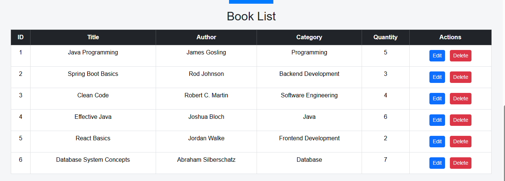
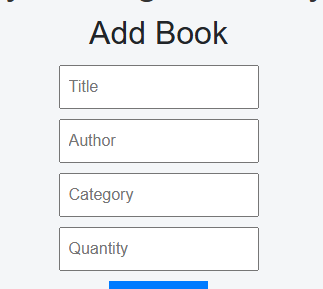
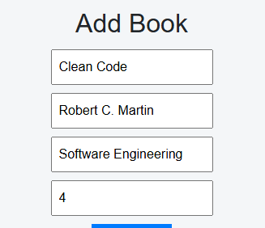
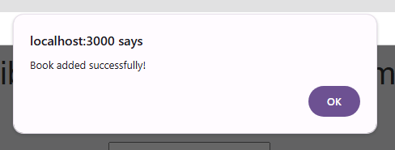

# 📚 Library Management System

A full-stack web application to manage books in a library using Spring Boot, React, and PostgreSQL.

---

## 🚀 Live Demo
- Frontend: https://verdant-kashata-03381c.netlify.app/
- Backend: Spring Boot REST API
- Database: Supabase (PostgreSQL)

---

## 📌 Features
- ➕ Add Book
- 📖 View Books
- ❌ Delete Book
- 🔗 REST API Integration
- 📱 Responsive UI

---

## 🛠 Tech Stack

### Frontend
- React.js
- HTML
- CSS
- JavaScript

### Backend
- Spring Boot
- Java
- REST API

### Database
- PostgreSQL (Supabase)

### Deployment
- Frontend: Netlify

---

## 📂 Project Structure

### Backend Repository
```bash
library-management-system
```

### Frontend Repository
```bash
library-frontend
```

---

## 📷 Screenshots

### 📚 Books List





### ✅ Add Book Success Alert

---

## ⚙️ How to Run Locally

### Backend
1. Clone repository
2. Open project in Eclipse or IntelliJ
3. Configure database in `application.properties`
4. Run Spring Boot Application

### Frontend
```bash
cd library-frontend
npm install
npm start
```

---

## 💡 Future Improvements
- Issue/Return Book Feature
- User Authentication
- Admin Dashboard
- Search and Filter Books

---

## 👨‍💻 Author
Siddhesh Mestry
